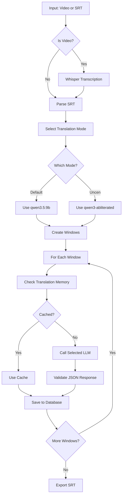

# subtitle-trans

> AI-powered subtitle translation tool using Whisper for transcription and Ollama LLM for translation.

[](https://www.python.org/)
[](LICENSE)

## Features

- **Automatic Transcription**: Convert video files to SRT using Whisper
- **Context-Aware Translation**: Translate subtitles with surrounding context (history/future lines)
- **Translation Memory**: Cache and reuse previous translations for consistency
- **Glossary Support**: Define custom terminology mappings with context hints
- **Windowed Processing**: Process subtitles in overlapping windows for better context
- **Checkpoint System**: Auto-save progress to prevent data loss
- **Circuit Breaker**: Handle API failures gracefully
- **Parallel Processing**: Optional multi-worker support
- **Interactive CLI**: User-friendly interface with file picker
- **Progress Bars**: Real-time progress visualization
- **Multi-Language Support**: Japanese, Korean, Chinese, English
- **Dual Translation Modes**: Default and Uncen (adult content) modes

## Screenshots

```
==============================
     SUBTITLE TRANSLATOR v1.2
==============================

Menu chinh:

  [1] Chon file Input          : video.mp4
  [2] Chon file Output         : output.srt
  [3] Ten Project              : my_project
  [4] Chon ngon ngu           : Nhat (Japanese) -> Viet (Vietnamese)
  [5] Che do dich             : [STD] Mac dinh (qwen3.5)
  [6] Chinh sua Glossary
  [7] Bat dau dich
  [0] Thoat

Window preset: size=6, history=12, future=4

[*] Starting pipeline for project: my_movie

[+] Parsed 1250 subtitle items

[>>] Processing translation queue...

Translating... |████████████████████░░░░|  75% (940/1250) (2m 30s remaining)

[OK] Pipeline finished successfully!

==================== Translation Summary ====================
| Metric               | Value           |
|-----------------------|-----------------|
| Total subtitles       | 1250            |
| Translated            | 1250            |
| Progress              | 100.0%          |
| Pending               | 0               |
| Failed (dead letter)  | 0               |
===========================================================
```

## Requirements

- Python 3.10+
- [Ollama](https://ollama.ai/) running locally (for translation)
- [FFmpeg](https://ffmpeg.org/) (for audio extraction)
- CUDA-capable GPU recommended (for Whisper)

## Installation

### Quick Start (Windows) - Recommended for beginners

1. Download/Clone the repository
2. Double-click `run.bat` - everything will be set up automatically!

```batch
run.bat
```

The script will:
- Create virtual environment if not exists
- Install all dependencies
- Check Ollama connection
- Create default config.yaml if needed
- Launch the application

### Manual Installation

```bash
# Clone the repository
git clone https://github.com/iamhieuxz/vid-transtosrt-vietsub.git
cd vid-transtosrt-vietsub

# Create virtual environment
python -m venv .venv
.venv\Scripts\activate  # Windows
# or
source .venv/bin/activate  # Linux/Mac

# Install dependencies
pip install -r requirements.txt

# Pull required Ollama models
ollama pull huihui_ai/qwen3-abliterated:8b-v2  # For Uncen mode
ollama pull qwen3.5:9b                          # For Default mode
```

## Usage

### Interactive Mode (Recommended)

```bash
python main.py
```

This opens an interactive menu where you can:
- Select input/output files via GUI file picker or manual input
- Edit project name
- Select source and target languages
- Choose translation mode (default/uncen)
- Manage glossary terms
- Start translation

### Command Line Mode

```bash
# With file paths and defaults
python main.py --input "video.mp4" --output "output.srt"

# With language selection (auto-applies window preset)
python main.py -i "video.mp4" -o "output.srt" -s ja -t vi

# With translation mode (default or uncen)
python main.py -i "video.mp4" -o "output.srt" -m uncen

# Force interactive mode
python main.py --interactive
```

### Translation Modes

| Mode | Model | Use Case |
|------|-------|----------|
| `[STD]` Default | qwen3.5:9b | General translation |
| `[+18]` Uncen | huihui_ai/qwen3-abliterated:8b-v2 | Adult/explicit content |

## Configuration

Edit `config.yaml`:

```yaml
# Translation mode settings
translation:
  mode: default  # default or uncen

# Model configurations
models:
  default:
    name: qwen3.5:9b
    ollama_url: http://localhost:11434/api/generate
    temperature: 0.05
    repeat_penalty: 1.15
    num_ctx: 6144
    num_predict: 1024
    timeout: 180
  
  uncen:
    name: huihui_ai/qwen3-abliterated:8b-v2
    ollama_url: http://localhost:11434/api/generate
    temperature: 0.05
    repeat_penalty: 1.15
    num_ctx: 6144
    num_predict: 1024
    timeout: 180

# Window presets by language
window:
  size: 6   # Auto-set based on source language
  history: 12
  future: 4
```

### Language & Window Presets

| Language | Code | Window Size | History | Future |
|----------|------|-------------|---------|--------|
| Japanese | ja | 6 | 12 | 4 |
| Korean | ko | 8 | 8 | 2 |
| Chinese | zh | 10 | 12 | 4 |
| English | en | 10 | 10 | 3 |

## Project Structure

```
vid-transtosrt-vietsub/
├── main.py              # Entry point with interactive CLI
├── config.yaml          # Configuration
├── requirements.txt     # Python dependencies
├── README.md            # This file
├── .gitignore           # Git ignore patterns
└── core/
    ├── __init__.py
    ├── database.py      # SQLite database operations
    ├── exporter.py      # SRT export functionality
    ├── pipeline.py      # Main translation pipeline
    ├── transcriber.py   # Whisper transcription
    ├── translator.py    # Ollama API integration
    └── validator.py     # Output validation
```

## Database

The tool uses SQLite (`translation.db`) to store:
- Projects and metadata
- Subtitle items (original + translated)
- Translation windows
- Translation memory
- Glossary terms
- Dead letter queue (failed translations)

## How It Works



1. **SRT Parsing**: Reads SRT file and splits into subtitle items
2. **Window Creation**: Groups subtitles into overlapping windows
3. **Context Building**: Adds history and future lines for context
4. **Translation**: Sends window to selected LLM with glossary and context
5. **Validation**: Verifies JSON output matches expected format
6. **Export**: Writes translated subtitles to SRT

## Troubleshooting

**YAML parsing error with Windows paths**
- Use single quotes for paths: `'E:\Videos\file.mp4'`

**Whisper not finding audio**
- Ensure FFmpeg is installed and in PATH

**Ollama connection failed**
- Check Ollama is running: `ollama serve`
- Verify URL in config: `http://localhost:11434`

**Translation quality issues**
- Adjust temperature (lower = more consistent)
- Add more glossary terms
- Increase window size for more context
- Try different translation mode for content type

## Development

```bash
# Run linting
ruff check .

# Format code
ruff format .

# Run tests (when available)
pytest
```

## License

MIT License - See [LICENSE](LICENSE) for details.

## Contributing

Contributions are welcome! Please feel free to submit a Pull Request.
