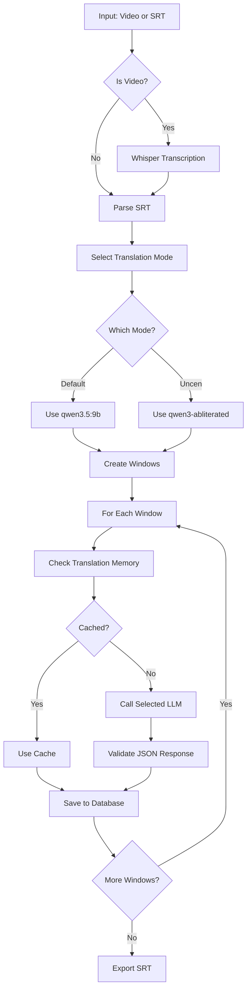
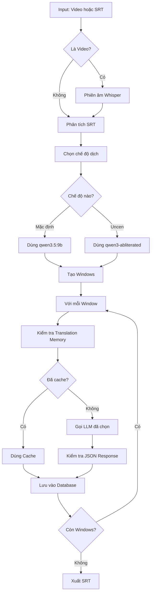

# subtitle-trans

> Công cụ dịch phụ đề tự động bằng AI, sử dụng Whisper để phiên âm và Ollama LLM để dịch.

[](https://www.python.org/)
[](LICENSE)
[](#english)
[](#tiếng-việt)

---

# English

## Features

- **Automatic Transcription**: Convert video files to SRT using Whisper
- **Context-Aware Translation**: Translate subtitles with surrounding context (history/future lines)
- **Translation Memory**: Cache and reuse previous translations for consistency
- **Glossary Support**: Define custom terminology mappings with context hints
- **Windowed Processing**: Process subtitles in overlapping windows for better context
- **Checkpoint System**: Auto-save progress to prevent data loss
- **Circuit Breaker**: Handle API failures gracefully
- **Parallel Processing**: Optional multi-worker support
- **Interactive CLI**: User-friendly interface with file picker
- **Progress Bars**: Real-time progress visualization
- **Multi-Language Support**: Japanese, Korean, Chinese, English
- **Dual Translation Modes**: Default and Uncen (adult content) modes

## Screenshots

```
==============================
     SUBTITLE TRANSLATOR v1.2
==============================

Main Menu:

  [1] Select Input File       : video.mp4
  [2] Select Output File      : output.srt
  [3] Project Name            : my_project
  [4] Select Language         : Japanese -> Vietnamese
  [5] Translation Mode        : [STD] Default (qwen3.5)
  [6] Edit Glossary
  [7] Start Translation
  [0] Exit

Window preset: size=6, history=12, future=4

[*] Starting pipeline for project: my_movie

[+] Parsed 1250 subtitle items

[>>] Processing translation queue...

Translating... |████████████████████░░░░|  75% (940/1250) (2m 30s remaining)

[OK] Pipeline finished successfully!

==================== Translation Summary ====================
| Metric               | Value           |
|-----------------------|-----------------|
| Total subtitles       | 1250            |
| Translated            | 1250            |
| Progress              | 100.0%          |
| Pending               | 0               |
| Failed (dead letter)  | 0               |
|===========================================================
```

## Requirements

- Python 3.10+
- [Ollama](https://ollama.ai/) running locally (for translation)
- [FFmpeg](https://ffmpeg.org/) (for audio extraction)
- CUDA-capable GPU recommended (for Whisper)

## Installation

### Quick Start (Windows)

1. Download/Clone the repository
2. Double-click `run.bat` - everything will be set up automatically!

```batch
run.bat
```

The script will:
- Create virtual environment if not exists
- Install all dependencies
- Check Ollama connection
- Create default config.yaml if needed
- Launch the application

### Manual Installation

```bash
# Clone the repository
git clone https://github.com/iamhieuxz/vid-transtosrt-vietsub.git
cd vid-transtosrt-vietsub

# Create virtual environment
python -m venv .venv
.venv\Scripts\activate  # Windows
# or
source .venv/bin/activate  # Linux/Mac

# Install dependencies
pip install -r requirements.txt

# Pull required Ollama models
ollama pull huihui_ai/qwen3-abliterated:8b-v2  # For Uncen mode
ollama pull qwen3.5:9b                          # For Default mode
```

## Usage

### Interactive Mode (Recommended)

```bash
python main.py
```

This opens an interactive menu where you can:
- Select input/output files via GUI file picker or manual input
- Edit project name
- Select source and target languages
- Choose translation mode (default/uncen)
- Manage glossary terms
- Start translation

### Command Line Mode

```bash
# With file paths and defaults
python main.py --input "video.mp4" --output "output.srt"

# With language selection (auto-applies window preset)
python main.py -i "video.mp4" -o "output.srt" -s ja -t vi

# With translation mode (default or uncen)
python main.py -i "video.mp4" -o "output.srt" -m uncen

# Force interactive mode
python main.py --interactive
```

### Translation Modes

| Mode | Model | Use Case |
|------|-------|----------|
| `[STD]` Default | qwen3.5:9b | General translation |
| `[+18]` Uncen | huihui_ai/qwen3-abliterated:8b-v2 | Adult/explicit content |

## Configuration

Edit `config.yaml`:

```yaml
# Translation mode settings
translation:
  mode: default  # default or uncen

# Model configurations
models:
  default:
    name: qwen3.5:9b
    ollama_url: http://localhost:11434/api/generate
    temperature: 0.05
    repeat_penalty: 1.15
    num_ctx: 6144
    num_predict: 1024
    timeout: 180
  
  uncen:
    name: huihui_ai/qwen3-abliterated:8b-v2
    ollama_url: http://localhost:11434/api/generate
    temperature: 0.05
    repeat_penalty: 1.15
    num_ctx: 6144
    num_predict: 1024
    timeout: 180

# Window presets by language
window:
  size: 6   # Auto-set based on source language
  history: 12
  future: 4
```

### Language & Window Presets

| Language | Code | Window Size | History | Future |
|----------|------|-------------|---------|--------|
| Japanese | ja | 6 | 12 | 4 |
| Korean | ko | 8 | 8 | 2 |
| Chinese | zh | 10 | 12 | 4 |
| English | en | 10 | 10 | 3 |

## Project Structure

```
vid-transtosrt-vietsub/
├── main.py              # Entry point with interactive CLI
├── config.yaml          # Configuration
├── requirements.txt     # Python dependencies
├── README.md            # This file
├── .gitignore           # Git ignore patterns
└── core/
    ├── __init__.py
    ├── database.py      # SQLite database operations
    ├── exporter.py      # SRT export functionality
    ├── pipeline.py      # Main translation pipeline
    ├── transcriber.py   # Whisper transcription
    ├── translator.py    # Ollama API integration
    └── validator.py     # Output validation
```

## Database

The tool uses SQLite (`translation.db`) to store:
- Projects and metadata
- Subtitle items (original + translated)
- Translation windows
- Translation memory
- Glossary terms
- Dead letter queue (failed translations)

## How It Works



1. **SRT Parsing**: Reads SRT file and splits into subtitle items
2. **Window Creation**: Groups subtitles into overlapping windows
3. **Context Building**: Adds history and future lines for context
4. **Translation**: Sends window to selected LLM with glossary and context
5. **Validation**: Verifies JSON output matches expected format
6. **Export**: Writes translated subtitles to SRT

## Troubleshooting

**YAML parsing error with Windows paths**
- Use single quotes for paths: `'E:\Videos\file.mp4'`

**Whisper not finding audio**
- Ensure FFmpeg is installed and in PATH

**Ollama connection failed**
- Check Ollama is running: `ollama serve`
- Verify URL in config: `http://localhost:11434`

**Translation quality issues**
- Adjust temperature (lower = more consistent)
- Add more glossary terms
- Increase window size for more context
- Try different translation mode for content type

## Development

```bash
# Run linting
ruff check .

# Format code
ruff format .

# Run tests (when available)
pytest
```

## License

MIT License - See [LICENSE](LICENSE) for details.

## Contributing

Contributions are welcome! Please feel free to submit a Pull Request.

---

# Tiếng Việt

## Tính năng

- **Tự động phiên âm**: Chuyển đổi file video sang SRT bằng Whisper
- **Dịch có ngữ cảnh**: Dịch phụ đề với ngữ cảnh xung quanh (dòng lịch sử/tương lai)
- **Bộ nhớ dịch**: Lưu cache và tái sử dụng bản dịch trước đó để đảm bảo tính nhất quán
- **Hỗ trợ Glossary**: Định nghĩa thuật ngữ tùy chỉnh với gợi ý ngữ cảnh
- **Xử lý theo cửa sổ**: Xử lý phụ đề theo cửa sổ chồng lấn để có ngữ cảnh tốt hơn
- **Hệ thống Checkpoint**: Tự động lưu tiến trình để tránh mất dữ liệu
- **Circuit Breaker**: Xử lý lỗi API một cách duyên dáng
- **Xử lý song song**: Hỗ trợ nhiều worker tùy chọn
- **Giao diện CLI tương tác**: Giao diện thân thiện với người dùng có file picker
- **Thanh tiến trình**: Hiển thị tiến trình thời gian thực
- **Hỗ trợ đa ngôn ngữ**: Nhật Bản, Hàn Quốc, Trung Quốc, Anh
- **Hai chế độ dịch**: Mặc định và Uncen (nội dung người lớn)

## Hình ảnh

```
==============================
     SUBTITLE TRANSLATOR v1.2
==============================

Menu chính:

  [1] Chọn file Input          : video.mp4
  [2] Chọn file Output         : output.srt
  [3] Tên Project               : my_project
  [4] Chọn ngôn ngữ            : Nhật (Japanese) -> Việt (Vietnamese)
  [5] Chế độ dịch              : [STD] Mặc định (qwen3.5)
  [6] Chỉnh sửa Glossary
  [7] Bắt đầu dịch
  [0] Thoát

Window preset: size=6, history=12, future=4

[*] Starting pipeline for project: my_movie

[+] Đã phân tích 1250 mục phụ đề

[>>] Đang xử lý hàng đợi dịch...

Đang dịch... |████████████████████░░░░|  75% (940/1250) (còn 2p 30s)

[OK] Pipeline hoàn thành thành công!

==================== Tổng kết dịch ====================
| Chỉ số                | Giá trị         |
|------------------------|------------------|
| Tổng phụ đề           | 1250             |
| Đã dịch               | 1250             |
| Tiến độ               | 100.0%           |
| Đang chờ              | 0                |
| Thất bại (dead letter)| 0                |
|=======================================================
```

## Yêu cầu

- Python 3.10+
- [Ollama](https://ollama.ai/) chạy cục bộ (để dịch)
- [FFmpeg](https://ffmpeg.org/) (để trích xuất âm thanh)
- GPU hỗ trợ CUDA được khuyến nghị (cho Whisper)

## Cài đặt

### Khởi động nhanh (Windows)

1. Tải/Clone repository
2. Nhấn đúp vào `run.bat` - mọi thứ sẽ được thiết lập tự động!

```batch
run.bat
```

Script sẽ:
- Tạo môi trường ảo nếu chưa có
- Cài đặt tất cả dependencies
- Kiểm tra kết nối Ollama
- Tạo config.yaml mặc định nếu cần
- Khởi chạy ứng dụng

### Cài đặt thủ công

```bash
# Clone repository
git clone https://github.com/iamhieuxz/vid-transtosrt-vietsub.git
cd vid-transtosrt-vietsub

# Tạo môi trường ảo
python -m venv .venv
.venv\Scripts\activate  # Windows
# hoặc
source .venv/bin/activate  # Linux/Mac

# Cài đặt dependencies
pip install -r requirements.txt

# Tải các model Ollama cần thiết
ollama pull huihui_ai/qwen3-abliterated:8b-v2  # Cho chế độ Uncen
ollama pull qwen3.5:9b                          # Cho chế độ Mặc định
```

## Sử dụng

### Chế độ tương tác (Khuyến nghị)

```bash
python main.py
```

Mở menu tương tác nơi bạn có thể:
- Chọn file input/output qua file picker hoặc nhập thủ công
- Chỉnh sửa tên project
- Chọn ngôn ngữ nguồn và đích
- Chọn chế độ dịch (mặc định/uncen)
- Quản lý thuật ngữ glossary
- Bắt đầu dịch

### Chế độ dòng lệnh

```bash
# Với đường dẫn file và mặc định
python main.py --input "video.mp4" --output "output.srt"

# Với chọn ngôn ngữ (tự động áp dụng window preset)
python main.py -i "video.mp4" -o "output.srt" -s ja -t vi

# Với chế độ dịch (default hoặc uncen)
python main.py -i "video.mp4" -o "output.srt" -m uncen

# Buộc chế độ tương tác
python main.py --interactive
```

### Chế độ dịch

| Chế độ | Model | Trường hợp sử dụng |
|--------|-------|---------------------|
| `[STD]` Mặc định | qwen3.5:9b | Dịch thông thường |
| `[+18]` Uncen | huihui_ai/qwen3-abliterated:8b-v2 | Nội dung người lớn |

## Cấu hình

Chỉnh sửa `config.yaml`:

```yaml
# Cài đặt chế độ dịch
translation:
  mode: default  # default hoặc uncen

# Cấu hình model
models:
  default:
    name: qwen3.5:9b
    ollama_url: http://localhost:11434/api/generate
    temperature: 0.05
    repeat_penalty: 1.15
    num_ctx: 6144
    num_predict: 1024
    timeout: 180
  
  uncen:
    name: huihui_ai/qwen3-abliterated:8b-v2
    ollama_url: http://localhost:11434/api/generate
    temperature: 0.05
    repeat_penalty: 1.15
    num_ctx: 6144
    num_predict: 1024
    timeout: 180

# Window presets theo ngôn ngữ
window:
  size: 6   # Tự động đặt theo ngôn ngữ nguồn
  history: 12
  future: 4
```

### Ngôn ngữ & Window Presets

| Ngôn ngữ | Mã | Kích thước Window | History | Future |
|----------|----|-------------------|---------|--------|
| Nhật Bản | ja | 6 | 12 | 4 |
| Hàn Quốc | ko | 8 | 8 | 2 |
| Trung Quốc | zh | 10 | 12 | 4 |
| Anh | en | 10 | 10 | 3 |

## Cấu trúc dự án

```
vid-transtosrt-vietsub/
├── main.py              # Điểm khởi đầu với CLI tương tác
├── config.yaml          # Cấu hình
├── requirements.txt     # Dependencies Python
├── README.md            # File này
├── .gitignore           # Git ignore patterns
└── core/
    ├── __init__.py
    ├── database.py      # Thao tác database SQLite
    ├── exporter.py      # Chức năng xuất SRT
    ├── pipeline.py      # Pipeline dịch chính
    ├── transcriber.py   # Phiên âm Whisper
    ├── translator.py    # Tích hợp API Ollama
    └── validator.py     # Kiểm tra đầu ra
```

## Cơ sở dữ liệu

Công cụ sử dụng SQLite (`translation.db`) để lưu trữ:
- Projects và metadata
- Các mục phụ đề (gốc + đã dịch)
- Translation windows
- Bộ nhớ dịch (Translation memory)
- Thuật ngữ Glossary
- Hàng đợi thất bại (dead letter queue)

## Cách hoạt động



1. **Phân tích SRT**: Đọc file SRT và tách thành các mục phụ đề
2. **Tạo Window**: Nhóm phụ đề thành các cửa sổ chồng lấn
3. **Xây dựng ngữ cảnh**: Thêm dòng lịch sử và tương lai để tạo ngữ cảnh
4. **Dịch**: Gửi window đến LLM đã chọn với glossary và ngữ cảnh
5. **Kiểm tra**: Xác minh đầu ra JSON khớp với định dạng mong đợi
6. **Xuất**: Ghi phụ đề đã dịch ra SRT

## Xử lý sự cố

**Lỗi phân tích YAML với đường dẫn Windows**
- Sử dụng dấu nháy đơn cho đường dẫn: `'E:\Videos\file.mp4'`

**Whisper không tìm thấy âm thanh**
- Đảm bảo FFmpeg đã được cài đặt và có trong PATH

**Kết nối Ollama thất bại**
- Kiểm tra Ollama đang chạy: `ollama serve`
- Xác minh URL trong config: `http://localhost:11434`

**Chất lượng dịch kém**
- Điều chỉnh temperature (thấp hơn = nhất quán hơn)
- Thêm nhiều thuật ngữ glossary hơn
- Tăng kích thước window để có ngữ cảnh tốt hơn
- Thử chế độ dịch khác cho loại nội dung

## Phát triển

```bash
# Chạy linting
ruff check .

# Format code
ruff format .

# Chạy tests (khi có sẵn)
pytest
```

## Giấy phép

MIT License - Xem [LICENSE](LICENSE) để biết chi tiết.

## Đóng góp

Rất mong nhận được đóng góp! Hãy thoải mái gửi Pull Request.
