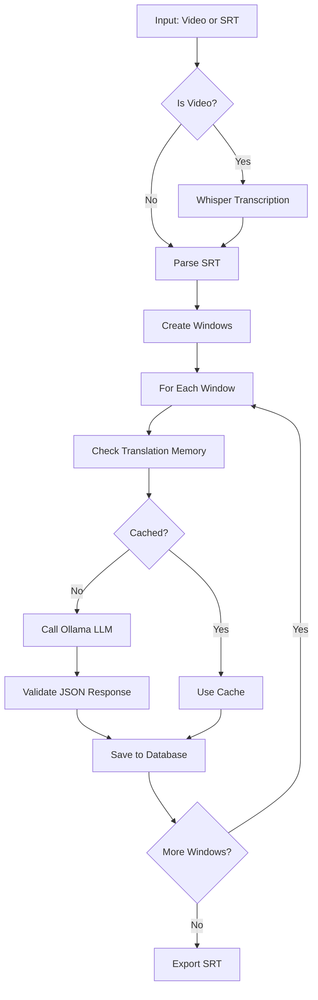

# subtitle-trans

> AI-powered subtitle translation tool using Whisper for transcription and Ollama LLM for translation.

[](https://www.python.org/)
[](LICENSE)

## Features

- **Automatic Transcription**: Convert video files to SRT using Whisper
- **Context-Aware Translation**: Translate subtitles with surrounding context (history/future lines)
- **Translation Memory**: Cache and reuse previous translations for consistency
- **Glossary Support**: Define custom terminology mappings with context hints
- **Windowed Processing**: Process subtitles in overlapping windows for better context
- **Checkpoint System**: Auto-save progress to prevent data loss
- **Circuit Breaker**: Handle API failures gracefully
- **Parallel Processing**: Optional multi-worker support
- **Interactive CLI**: User-friendly interface with file picker
- **Progress Bars**: Real-time progress visualization

## Screenshots

```
==============================
      SUBTITLE TRANSLATOR v1.0
==============================

[*] Starting pipeline for project: my_movie

[+] Parsed 1250 subtitle items

[>>] Processing translation queue...

Translating... |████████████████████░░░░|  75% (940/1250) (2m 30s remaining)

[OK] Pipeline finished successfully!

==================== Translation Summary ====================
| Metric               | Value           |
|-----------------------|-----------------|
| Total subtitles       | 1250            |
| Translated            | 1250            |
| Progress              | 100.0%          |
| Pending               | 0               |
| Failed (dead letter)  | 0               |
===========================================================
```

## Requirements

- Python 3.10+
- [Ollama](https://ollama.ai/) running locally (for translation)
- [FFmpeg](https://ffmpeg.org/) (for audio extraction)
- CUDA-capable GPU recommended (for Whisper)

## Installation

```bash
# Clone the repository
git clone https://github.com/iamhieuxz/vid-transtosrt-vietsub.git
cd vid-transtosrt-vietsub

# Create virtual environment
python -m venv .venv
.venv\Scripts\activate  # Windows
# or
source .venv/bin/activate  # Linux/Mac

# Install dependencies
pip install -r requirements.txt

# Install Ollama and pull a model
ollama pull huihui_ai/qwen3-abliterated:8b-v2
```

## Usage

### Interactive Mode (Recommended)

```bash
python main.py
```

This opens an interactive menu where you can:
- Select input/output files via GUI file picker or manual input
- Edit project name
- Manage glossary terms
- Start translation

### Command Line Mode

```bash
# With file paths
python main.py --input "video.mp4" --output "output.srt"

# Using short flags
python main.py -i "video.mp4" -o "output.srt"

# Force interactive mode
python main.py --interactive
```

## Configuration

Edit `config.yaml`:

```yaml
whisper:
  model_size: "large-v3-turbo"     # whisper model size
  device: "cuda"                    # or "cpu"
  compute_type: "float16"           # or "int8" for CPU
  language: ja                      # null = auto-detect
  beam_size: 5
  vad_filter: true
  min_silence_duration_ms: 500

project:
  name: my_movie
  source_lang: Japanese
  target_lang: Vietnamese
  input_srt: 'E:\Videos\my_video.mp4'  # Video or SRT file
  output_srt: 'E:\Videos\my_video-vi.srt'

window:
  size: 6                           # Lines per window
  history: 12                       # Previous lines for context
  future: 4                         # Next lines for context

model:
  name: huihui_ai/qwen3-abliterated:8b-v2
  ollama_url: http://localhost:11434/api/generate
  temperature: 0.05
  repeat_penalty: 1.15
  num_ctx: 6144
  num_predict: 1024
  timeout: 180

pipeline:
  enable_glossary: true
  retry_delay: 2
  num_workers: 1                    # 1 = sequential, >1 = parallel
  checkpoint_interval: 20
  heartbeat_timeout: 600
  circuit_breaker_threshold: 5
  circuit_breaker_cooldown: 60

glossary:
  - source: 형님
    target: đại ca
    context: gangster movie
  - source: 선배
    target: tiền bối
    context: workplace
```

## Project Structure

```
vid-transtosrt-vietsub/
├── main.py              # Entry point with interactive CLI
├── config.yaml          # Configuration
├── requirements.txt     # Python dependencies
├── README.md            # This file
├── .gitignore           # Git ignore patterns
└── core/
    ├── __init__.py
    ├── database.py      # SQLite database operations
    ├── exporter.py      # SRT export functionality
    ├── pipeline.py      # Main translation pipeline
    ├── transcriber.py   # Whisper transcription
    ├── translator.py    # Ollama API integration
    └── validator.py     # Output validation
```

## Database

The tool uses SQLite (`translation.db`) to store:
- Projects and metadata
- Subtitle items (original + translated)
- Translation windows
- Translation memory
- Glossary terms
- Dead letter queue (failed translations)

## How It Works



1. **SRT Parsing**: Reads SRT file and splits into subtitle items
2. **Window Creation**: Groups subtitles into overlapping windows
3. **Context Building**: Adds history and future lines for context
4. **Translation**: Sends window to LLM with glossary and context
5. **Validation**: Verifies JSON output matches expected format
6. **Export**: Writes translated subtitles to SRT

## Troubleshooting

**YAML parsing error with Windows paths**
- Use single quotes for paths: `'E:\Videos\file.mp4'`

**Whisper not finding audio**
- Ensure FFmpeg is installed and in PATH

**Ollama connection failed**
- Check Ollama is running: `ollama serve`
- Verify URL in config: `http://localhost:11434`

**Translation quality issues**
- Adjust temperature (lower = more consistent)
- Add more glossary terms
- Increase window size for more context

## Development

```bash
# Run linting
ruff check .

# Format code
ruff format .

# Run tests (when available)
pytest
```

## License

MIT License - See [LICENSE](LICENSE) for details.

## Contributing

Contributions are welcome! Please feel free to submit a Pull Request.
